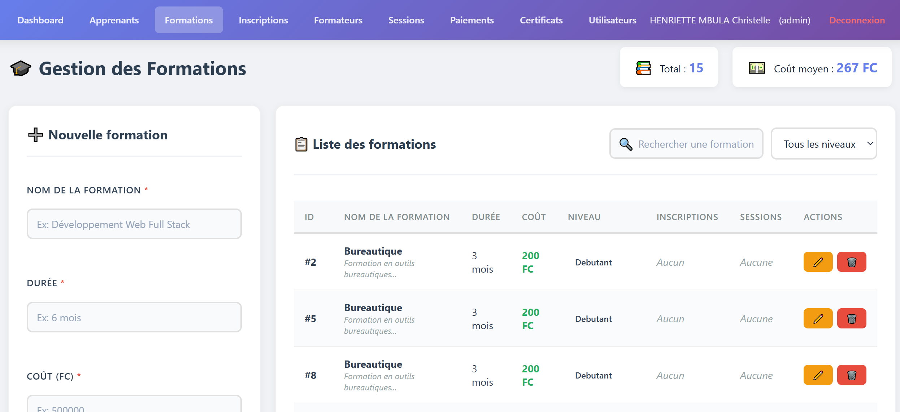
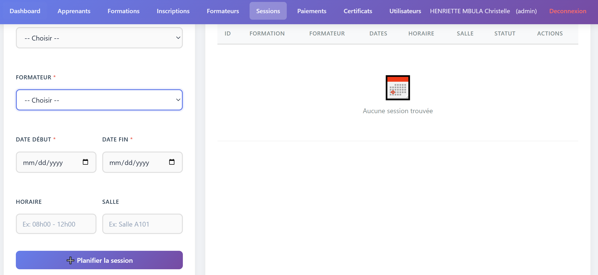
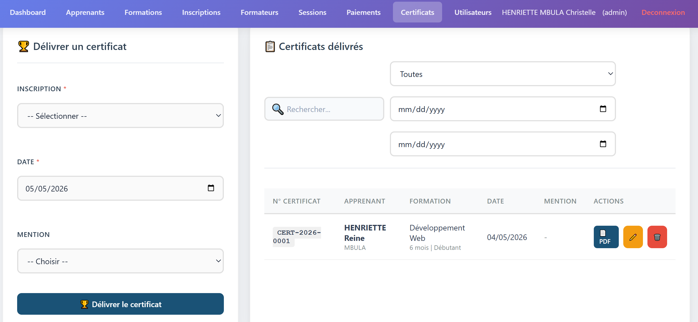
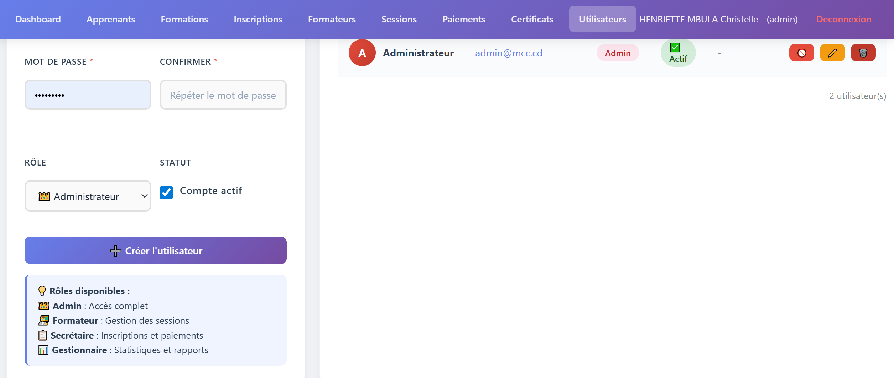

# 🏫 MCC Gestion — Système de Gestion pour Centres de Formation


> **Solution complète de gestion administrative, pédagogique et financière pour centres de formation professionnelle.**

MCC Gestion est une application web robuste, modulaire et sécurisée, conçue pour centraliser et optimiser l'ensemble des opérations d'un centre de formation : apprenants, formations, inscriptions, formateurs, sessions, paiements et certificats. Développée en PHP vanilla avec une architecture orientée modules, elle offre une interface moderne, entièrement responsive, sans aucune dépendance externe.

---

## 📸 Aperçu de l'interface

<div align="center">

### 🔐 Page de connexion


### 📊 Tableau de bord


| Module | Aperçu | Module | Aperçu |
|:------:|:------:|:------:|:------:|
| 📚 **Apprenants** |  | 🎓 **Formations** |  |
| 📝 **Inscriptions** |  | 👨‍🏫 **Formateurs** |  |
| 📅 **Sessions** |  | 💵 **Paiements** |  |
| 📜 **Certificats** |  | 🖨️ **Certificat PDF** |  |
| 👥 **Utilisateurs** |  | | |

</div>

---

## 🚀 Fonctionnalités clés

### 🔐 Authentification & Sécurité

- Protection **CSRF** sur tous les formulaires
- **Limitation des tentatives** de connexion (5 essais, blocage 5 minutes)
- Hachage des mots de passe avec **bcrypt** (`password_hash`)
- Système **"Se souvenir de moi"** via token sécurisé en base de données
- Journalisation exhaustive des connexions/déconnexions (`logs/login.log`)
- Protection **XSS** (`htmlspecialchars`) et **injections SQL** (requêtes préparées PDO)
- Régénération des sessions après authentification
- Redirection automatique des utilisateurs déjà connectés
- Page de connexion épurée avec modal **"Mot de passe oublié"**

### 📊 Tableau de bord — Pilotage en temps réel

- 6 **cartes statistiques cliquables** (Apprenants, Formations, Inscriptions, Formateurs, Sessions, Revenus)
- **Graphique d'évolution** des inscriptions sur 6 mois (barres animées)
- 4 **indicateurs de performance** : Actives, Terminées, En cours, Taux de réussite
- **Revenus du mois** avec barre de progression dynamique
- **Top 4 des formations** les plus populaires
- **Prochaines sessions** planifiées avec dates
- **Dernières inscriptions** avec statuts colorés
- Layout responsive **Grid + Flexbox (70/30)**
- Animations CSS au chargement

### 📚 Gestion des apprenants (CRUD)

- Fiche détaillée : Nom, Postnom, Prénom, Sexe, Date de naissance, Téléphone, Email, Adresse
- Validation des champs obligatoires et format email
- **Recherche en temps réel** avec debounce (500 ms)
- **Filtrage par sexe** (Hommes / Femmes / Tous)
- **Avatars avec initiales** colorées (bleu pour hommes, rose pour femmes)
- Compteur d'inscriptions avec noms des formations suivies
- Protection contre la suppression si des inscriptions sont liées
- Statistiques rapides : Total, Hommes, Femmes, Inscriptions

### 🎓 Gestion des formations (CRUD)

- Nom, Durée, Coût (max 200$), Niveau (Débutant / Intermédiaire / Avancé), Description
- **Recherche en temps réel** avec debounce
- **Filtrage par niveau**
- Nombre d'inscriptions et de sessions liées
- **Badges colorés** par niveau
- Protection contre la suppression si dépendances
- Formulaire **sticky** (reste visible pendant le défilement)

### 📝 Gestion des inscriptions (CRUD)

- Liaison **Apprenant ↔ Formation** via listes déroulantes
- **Affichage du coût en temps réel** à la sélection
- Calcul automatique du **solde restant** (Coût total - Total payé)
- Statuts : En cours, Actif, En attente, Terminé, Abandonné
- Lien direct vers la gestion des paiements
- **Badges de statut colorés**
- **Vérification anti-doublon** : un apprenant ne peut s'inscrire deux fois à la même formation
- Barre de statistiques (Total, Actives, Terminées, Revenus)

### 👨‍🏫 Gestion des formateurs (CRUD)

- Profil complet : Nom, Spécialité, Téléphone, Email
- **Autocomplétion des spécialités** (datalist)
- Validation d'email unique
- Vue détaillée en modal des sessions assignées
- Nombre de sessions associées
- Avatars avec initiales

### 📅 Gestion des sessions (CRUD)

- **Double vue** : Tableau + Calendrier mensuel interactif
- Planification : Dates début/fin, Horaire, Salle
- **Détection automatique du statut** (En cours, À venir, Terminée)
- Durée calculée automatiquement en jours
- **Vérification des conflits de salle** sur la période
- Filtrage par statut et par formation
- Calendrier avec **pastilles de couleur** pour les jours occupés

### 💵 Gestion des paiements (CRUD)

- Suivi financier complet par inscription
- **Calcul automatique du solde restant**
- **Barres de progression** du paiement (pourcentage)
- Blocage si le montant saisi dépasse le reste à payer
- Modes de paiement : Espèces, Virement, Mobile Money, Chèque, Carte bancaire
- **Filtrage par mode** et par période (date début/fin)
- **Répartition graphique** par mode de paiement
- Présélection depuis le module Inscriptions
- Statistiques : Total perçu, Ce mois, Transactions, Soldes impayés

### 📜 Gestion des certificats (CRUD)

- Mentions : Excellence, Distinction, Satisfaction, Passable
- **Numérotation automatique** (CERT-AAAA-NNNN)
- **Génération de PDF professionnel** via FPDF
- Design : double cadre bleu marine et or, fond ivoire
- **QR Code intégré** pour vérification d'authenticité
- Date de délivrance, durée, niveau, description de la formation
- Zones de signatures (Directeur, Formateur, Apprenant)
- Format Lettre paysage, une seule page
- **Nettoyage automatique des accents** pour compatibilité PDF
- Téléchargement direct du PDF dans le navigateur
- Protection : **un seul certificat par inscription**
- Filtrage par mention et par période
- Répartition statistique par mention

### 👥 Gestion des utilisateurs (CRUD)

- **Réservé aux administrateurs** (vérification de rôle)
- 4 rôles : Admin, Formateur, Secrétaire, Gestionnaire
- **Activation / Désactivation** en un clic (toggle)
- **Indicateur de force du mot de passe** (barre colorée)
- Confirmation du mot de passe
- Protection contre **l'auto-suppression** et **l'auto-désactivation**
- Protection du **dernier administrateur**
- Avatars colorés par rôle avec initiales
- Filtrage par rôle et par statut (actif / inactif)
- Description des permissions par rôle

---

## 🛠️ Stack technique

| Catégorie | Technologie | Détails |
|-----------|-------------|---------|
| **Backend** | PHP 8.0+ | PDO, requêtes préparées, architecture modulaire |
| **Base de données** | MySQL 5.7+ / MariaDB 10.4+ | Moteur InnoDB, contraintes FK, index |
| **Frontend** | HTML5, CSS3, JavaScript | CSS Grid, Flexbox, Vanilla JS, animations CSS3 |
| **Sécurité** | CSRF, bcrypt, Sessions | Protection OWASP Top 10 |
| **PDF** | FPDF | Génération de certificats sans dépendance externe |
| **QR Code** | API qrserver.com | Code QR intégré aux certificats |
| **Design** | CSS personnalisé | 0 dépendance externe, responsive design |
| **Icônes** | Emoji natifs | Aucune librairie d'icônes requise |

---

## 📦 Installation rapide

### Prérequis

| Composant | Version minimale | Recommandé |
|-----------|------------------|-------------|
| PHP | 7.4 | 8.2+ |
| MySQL | 5.7 | 8.0+ / MariaDB 10.4+ |
| Apache | 2.4 | 2.4+ |
| Navigateur | Chrome 80+, Firefox 80+ | Dernière version |

### Procédure d'installation

1. **Cloner le dépôt**
   ```bash
   git clone https://github.com/cosmas-webdev/gestion_mcc.git
   cd gestion_mcc